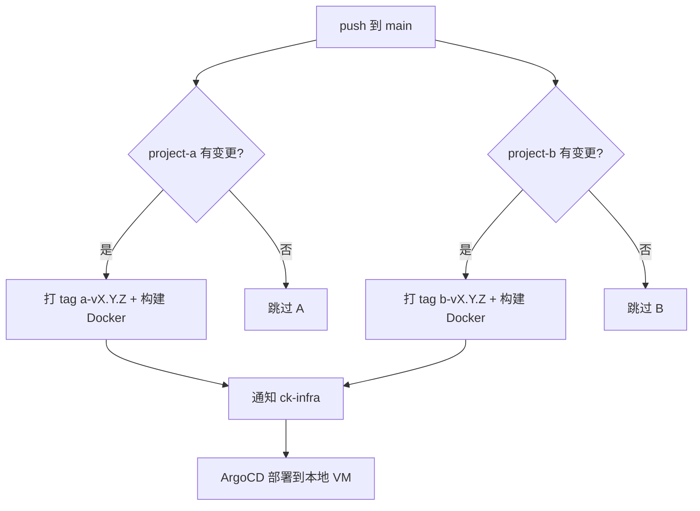

# ck-develop

多语言 Monorepo 父项目。各子项目完全独立，合并到 `main` 后由 GitHub Actions 自动检测变更、打 tag、构建 Docker 镜像，并通知 [ck-infra](https://github.com/zhang-zixu/ck-infra) 部署到本地 VM。

## 目录结构

```
ck-develop/
├── .github/
│   ├── actions/
│   │   └── release-project/
│   │       └── action.yml          # 自动打 tag 的复用逻辑
│   └── workflows/
│       └── release.yml               # CI/CD 工作流
├── project-a/
│   ├── src/
│   │   └── main.py                   # 应用入口（FastAPI）
│   ├── Dockerfile
│   ├── requirements.txt
│   ├── VERSION                       # 版本号文件
│   └── .gitignore
├── project-b/
│   ├── src/
│   │   └── main.py
│   ├── Dockerfile
│   ├── requirements.txt
│   ├── VERSION
│   └── .gitignore
├── .gitignore
└── README.md
```

## 发布规则

| 子项目 | 变更路径 | Tag 格式 | Docker 镜像 |
|--------|----------|----------|-------------|
| project-a | `project-a/**` | `a-v1.0.0` | `ghcr.io/zhang-zixu/ck-develop/project-a:a-v1.0.0` |
| project-b | `project-b/**` | `b-v1.0.0` | `ghcr.io/zhang-zixu/ck-develop/project-b:b-v1.0.0` |

- 两个项目**完全独立**，版本互不影响
- 只有对应目录有变更时才发布（a 变只发 a，b 变只发 b）
- 首次发布使用 `VERSION` 文件中的版本；之后自动递增 patch
- 镜像构建完成后自动通知 ck-infra 更新部署

## 工作流程



## 使用前准备

1. 推送到 GitHub
2. Settings → Actions → General → Workflow permissions 设为 **Read and write permissions**
3. 在仓库 Secrets 中添加 `INFRA_DISPATCH_TOKEN`（有 `repo` 权限的 PAT，用于触发 ck-infra）
4. 各子项目自行维护 `Dockerfile`

## 新增子项目

1. 在根目录创建 `project-x/` 目录，放入源码、`Dockerfile`、`VERSION`
2. 在 `.github/workflows/release.yml` 的 `detect-changes` 中增加路径过滤
3. 复制 `docker-project-a` job，改为 `project-x` 和对应 tag 前缀
4. 在 ck-infra 中增加对应的 Application 和 overlay

## 自定义

- **版本递增策略**：修改 `.github/actions/release-project/action.yml`
- **Tag 命名**：修改 workflow 中各 job 的 `tag_prefix` 参数
- **Docker Registry**：修改 `release.yml` 中的 `REGISTRY` 环境变量
- **部署目标**：修改 `release.yml` 中的 `INFRA_REPO` 环境变量
