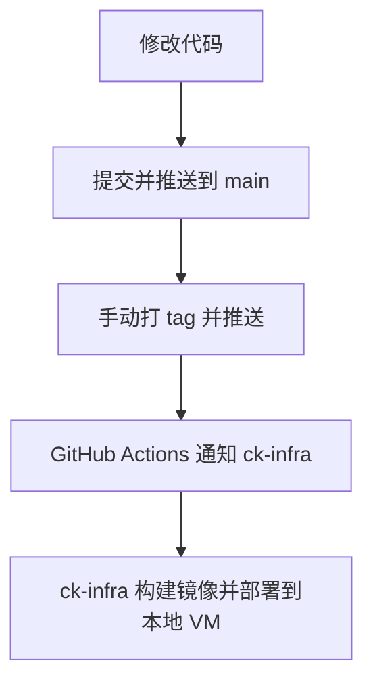

# ck-develop

应用代码仓库。各子项目完全独立，**手动打 tag** 后由 GitHub Actions 通知 [ck-infra](https://github.com/zhang-zixu/ck-infra) 更新镜像 tag，由 ck-infra 负责构建和部署到本地 VM。

## 目录结构

```
ck-develop/
├── project-a/
│   ├── src/main.py
│   ├── Dockerfile
│   ├── requirements.txt
│   └── VERSION
├── project-b/
│   ├── src/main.py
│   ├── Dockerfile
│   ├── requirements.txt
│   └── VERSION
└── .github/
    └── workflows/release.yml   # 推送 tag → 通知 ck-infra
```

## 发布规则

| 子项目 | Tag 格式 | 通知内容 |
|--------|----------|----------|
| project-a | `a-v1.0.0` | `{"project":"project-a","tag":"a-v1.0.0"}` |
| project-b | `b-v1.0.0` | `{"project":"project-b","tag":"b-v1.0.0"}` |

- 本仓库**只负责通知** ck-infra 更新镜像 tag
- 镜像构建和部署由 ck-infra 完成
- tag 需手动创建并推送

## 手动发布流程

```bash
# 1. 修改代码并推送
git add project-a/
git commit -m "feat(project-a): some change"
git push origin main

# 2. 手动打 tag 并推送（触发通知 ck-infra）
git tag a-v1.0.5
git push origin a-v1.0.5
```

## 工作流程



## 使用前准备

1. 推送到 GitHub
2. 在仓库 Secrets 中添加 `INFRA_DISPATCH_TOKEN`（有 `repo` 权限的 PAT，用于触发 ck-infra）
3. 确保 ck-infra 已配置好镜像构建和 ArgoCD 部署

## 新增子项目

1. 创建 `project-x/` 目录，放入源码和 `Dockerfile`
2. 在 `release.yml` 的 `on.push.tags` 中增加 `x-v*`
3. 复制 `notify-project-a` job，改为 `project-x` 和对应前缀
4. 在 ck-infra 中增加对应的构建和部署配置
