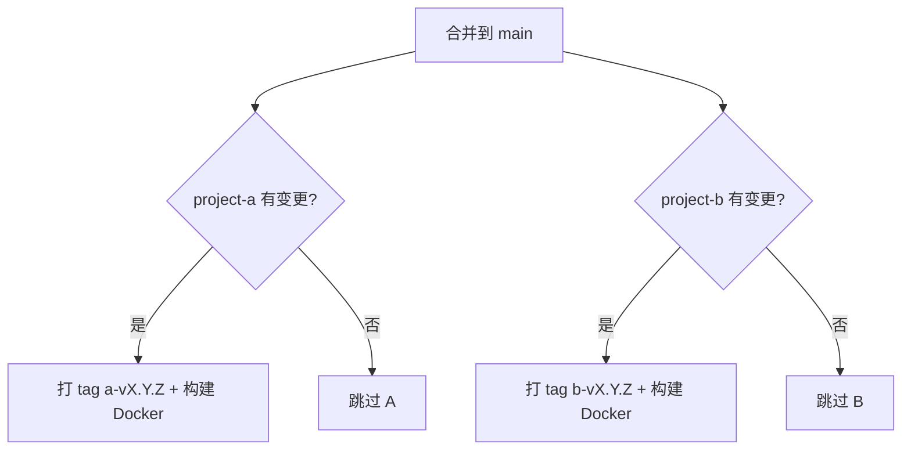

# ck-develop

多语言 Monorepo 父项目。各子项目完全独立（可为 Java、C#、C++、Python 等），合并到 `main` 后由 **纯 GitHub Actions** 自动打 tag 并构建 Docker 镜像。

## 目录结构

```
ck-develop/
├── project-a/                  # 子项目 A（语言自定）
│   ├── Dockerfile
│   └── VERSION
├── project-b/                  # 子项目 B（语言自定）
│   ├── Dockerfile
│   └── VERSION
└── .github/
    ├── workflows/release.yml   # 合并 main 时自动发布
    └── actions/release-project/  # 可复用的打 tag 逻辑
```

## 发布规则

| 子项目 | 变更路径 | Tag 格式 | Docker 镜像 |
|--------|----------|----------|-------------|
| project-a | `project-a/**` | `a-v1.0.0` | `ghcr.io/<owner>/<repo>/project-a:a-v1.0.0` |
| project-b | `project-b/**` | `b-v1.0.0` | `ghcr.io/<owner>/<repo>/project-b:b-v1.0.0` |

- 两个项目**完全独立**，版本互不影响
- 只有对应目录有变更时才发布（a 变只发 a，b 变只发 b）
- 首次发布使用 `VERSION` 文件中的版本；之后自动递增 patch

## 工作流程



## 新增子项目

1. 在根目录创建 `project-x/` 目录，放入源码和 `Dockerfile`、`VERSION`
2. 在 `.github/workflows/release.yml` 的 `detect-changes` 中增加路径过滤
3. 复制 `release-project-a` job，改为 `project-x` 和对应 tag 前缀

## 使用前准备

1. 推送到 GitHub
2. Settings → Actions → General → Workflow permissions 设为 **Read and write permissions**
3. 各子项目自行维护 `Dockerfile`（按语言选择基础镜像）

## 自定义

- **版本递增策略**：修改 `.github/actions/release-project/action.yml`
- **Tag 命名**：修改 workflow 中各 job 的 `tag_prefix` 参数
- **Docker Registry**：修改 `release.yml` 中的 `REGISTRY` 环境变量
