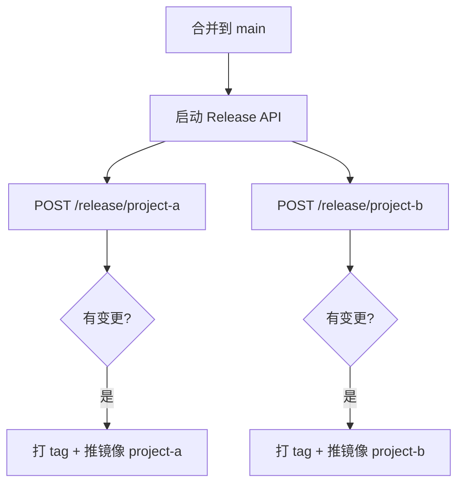

# ck-develop

模块化 Monorepo 父项目，包含两个独立子模块，通过 **Release API** 提供 HTTP 接口完成版本发布、打 Tag 和 Docker 构建。

## 目录结构

```
ck-develop/
├── project-a/              # 子项目 A
│   ├── src/
│   ├── Dockerfile
│   └── VERSION
├── project-b/              # 子项目 B
│   ├── src/
│   ├── Dockerfile
│   └── VERSION
├── release-api/            # 发布 Web API（两个项目各一个接口）
│   ├── app/
│   │   ├── main.py
│   │   └── services/git_release.py
│   └── requirements.txt
└── .github/workflows/
    └── release.yml         # 合并 main 时调用 API 自动发布
```

## Release API 接口

启动服务：

```bash
cd release-api
pip install -r requirements.txt
uvicorn app.main:app --reload --port 8000
```

| 方法 | 路径 | 说明 |
|------|------|------|
| GET | `/health` | 健康检查 |
| GET | `/release/project-a/check` | 检查 project-a 是否有变更 |
| GET | `/release/project-b/check` | 检查 project-b 是否有变更 |
| **POST** | **`/release/project-a`** | **发布 project-a（检测变更 → 打 tag）** |
| **POST** | **`/release/project-b`** | **发布 project-b（检测变更 → 打 tag）** |

### 发布接口示例

```bash
# 有变更才发布
curl -X POST http://localhost:8000/release/project-a

# 强制发布（忽略变更检测）
curl -X POST "http://localhost:8000/release/project-a?force=true"
```

成功响应：

```json
{
  "project": "project-a",
  "changed": true,
  "released": true,
  "version": "1.0.1",
  "tag": "a-v1.0.1",
  "changed_files": ["project-a/src/main.py"],
  "message": "已创建 tag: a-v1.0.1"
}
```

无变更时跳过：

```json
{
  "project": "project-a",
  "changed": false,
  "released": false,
  "version": null,
  "tag": null,
  "changed_files": [],
  "message": "project-a 无变更，跳过发布"
}
```

Swagger 文档：启动后访问 http://localhost:8000/docs

## 版本与 Tag 规则

| 子项目 | Tag 前缀 | 示例 |
|--------|----------|------|
| project-a | `a-v` | `a-v1.0.0`, `a-v1.0.1` |
| project-b | `b-v` | `b-v1.0.0`, `b-v1.0.1` |

- 两个项目版本**完全独立**，互不影响
- 合并到 `main` 时，CI 调用对应 POST 接口，仅有变更才发布
- 首次发布使用 `VERSION` 文件版本；之后自动递增 patch

## Docker 镜像

合并到 `main` 且有变更时，CI 在 API 打 tag 后自动构建并推送：

```
ghcr.io/<owner>/<repo>/project-a:a-v1.0.0
ghcr.io/<owner>/<repo>/project-b:b-v1.0.0
```

## 工作流程



## 本地开发

```bash
# 运行子项目
python project-a/src/main.py
python project-b/src/main.py

# 本地构建 Docker
docker build -t project-a:local ./project-a
docker build -t project-b:local ./project-b
```

## 使用前准备

1. 初始化 Git 并推送到 GitHub
2. Settings → Actions → General → Workflow permissions 设为 **Read and write permissions**
3. 如需其他 Docker Registry，修改 `.github/workflows/release.yml` 中的 `REGISTRY`

## 自定义

- **版本递增策略**：修改 `release-api/app/services/git_release.py` 中的 `_next_version`
- **Tag 命名**：修改 `PROJECTS` 配置中的 `tag_prefix`
- **新增子项目**：在 `PROJECTS` 和 `main.py` 中增加对应接口
